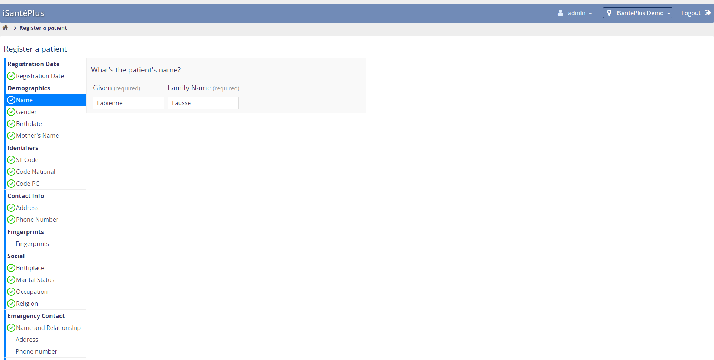
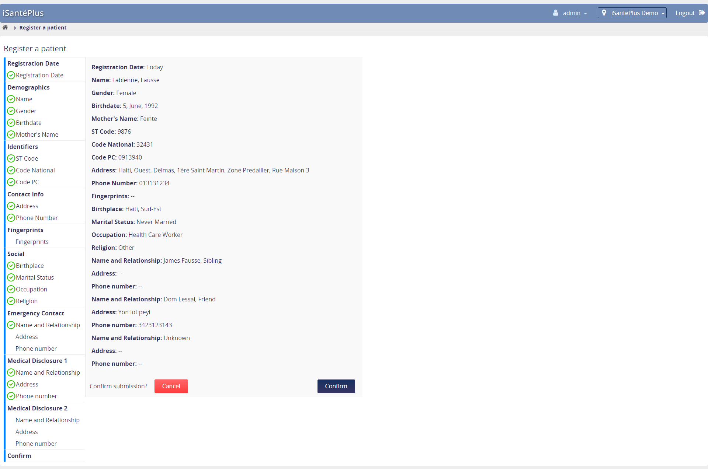
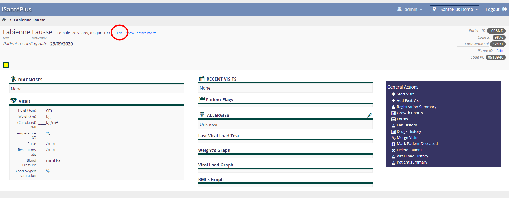
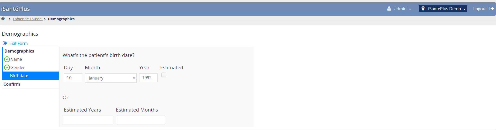
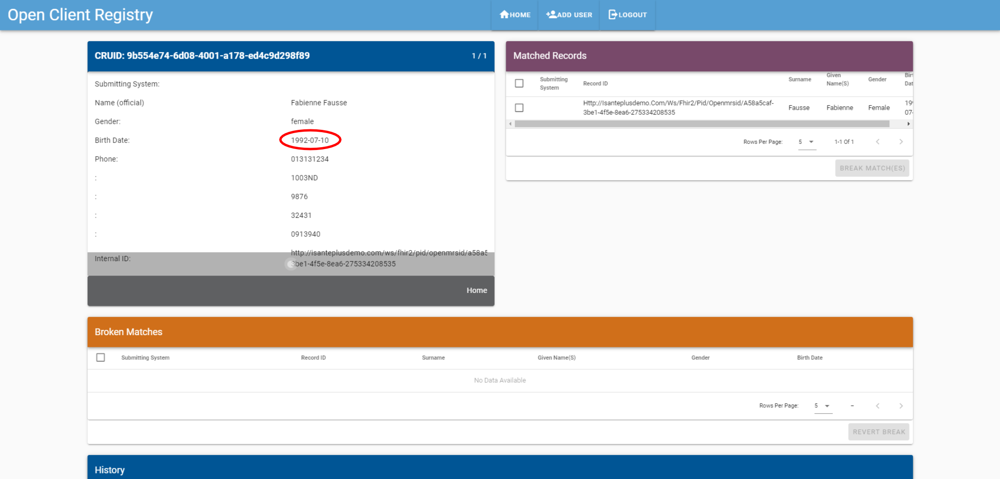
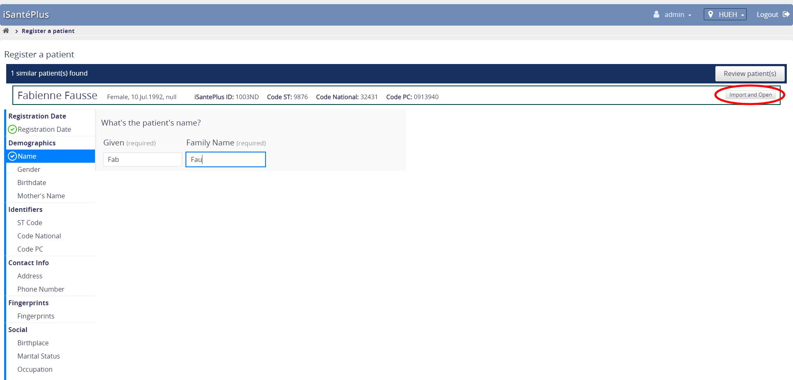
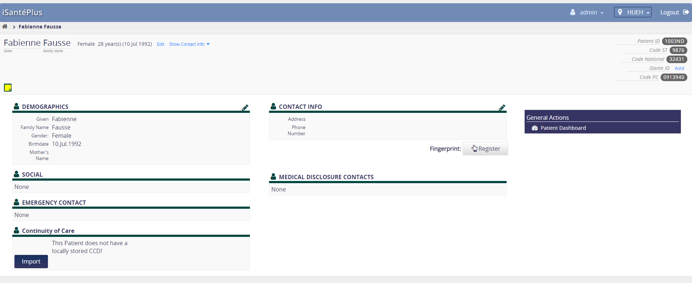

# Synchronization of Clinical Data 

## Synchronization of Patient Data
This tutorial demonstrates the FHIR-based synhronization of patient data between iSantePlus instances. 

The demonstrated communication workflow involves the following components:
 - a **Master Patient Index (MPI)**
 - a **Shared Health Record (SHR)**
 - and two instances of **iSantePlus**

The communication between these systems utilizes the FHIR clinical data standard for representing clinical data, and is orchestrated by the [OpenHIM](http://openhim.org/) middleware. 

### Patient Creation and Import - The MPI Workflow
**[Link to Video](https://youtu.be/WK5n3jDmkfk)**

For the first part of this tutorial, we'll be using the MPI to synchronize patient registration data across two iSantePlus instances. 

**I) Create a Patient**
1. Log into https://isanteplusdemo.com/openmrs
2. Click `Register a Patient`
3. Fill in all of the required patient information, including an error in the spelling of the name

4. Click `Confirm` to create the patient

**II)  View Patient in OpenCR**
1. Log into http://18.158.139.243:3000/crux/#/Login
2. Search for your created patient by `Surname` to find the entry.

3. Click on the patient to view the patient information.

**III)  Update Patient Birthdate**
1. Go back to the patient chart in isanteplusdemo.com/openmrs
2. Click `Edit` next to the patient name on the top of the screen

2. Change the patient's date of birth

3. Go back to the OpenCR patient page and refresh to view the updated date of birth

**IV) Import Patient in a 2nd Location**
1. Log into http://52.37.13.123:8080/openmrs/
2. Click `Register a Patient`
3. Begin typing in the names of the patient you created in step `I)`
4. You should see a notification show up at the top of the screen with existing patient suggestions. 
5. Click on the `Review Patient(s)` button and import your patient by clicking the `Import and Open` button.

6. You should see a new patient created with information from the MPI

**II)  View Patient in OpenCR**
1. Go back to the MPI patient page and refresh
2. You should see two linked patient records for this patient - one from each iSantePlus instance

### Viewing Continuity of Care Documents - the SHR workflow
**[Link to Video](https://youtu.be/9S8CGI-5vl0)**

For the second part of this tutorial, we will be using the patient `Rafael Lessai`. This patient was created in the iSantePlus instance available at www.isanteplusdemo.com/openmrs, but does not exist in the instance at http://52.37.13.123:8080/openmrs. 

To start, we will import this patient in the second iSantePlus instance, review the Continuity of Care document (CCD) for the patient,
add some additional clinical data, and see this information represented in the CCD of the original instance.

**I) Review Patient data in isanteplusdemo.com**
1. Log into https://isanteplusdemo.com/openmrs
2. Go to `Find Patient Record`

**II) Import the Patient in Another Location**
1. Log into http://52.37.13.123:8080/openmrs/
2. Click `Register a Patient`
3. Begin typing in the names of the patient you created in step `I`
4. You should see a notification show up at the top of the screen with existing patient suggestions. 
5. Click on the `Review Patient(s)` button and import your patient by clicking the `Import and Open` button.of the screen with existing patient suggestions. 
6. You will end up on the imported patient's registration summary. 

**III) View CCD for imported patient**
1. On the patient registration summary page, look for the `Continuity of Care` section. 
2. Click on the `Import` button to import the patient's CCD from the Shared Health Record
3. Go back to the registration summary page, and click `View`
4. You should see the patient's CCD open in a new window. 

**V) Create a bit of medical history**
1. Go back to your patient's chart, and add to the medical history a bit:
    a. Click on the `Edit` button in the `Allergies` section and add some allergy for the patient
    b. Click on `Start Visit` to begin a visit for the patient
    c. Under the `Forms` tab, click on the `Laboratory/Dispense` section and select `Analyse de Laboratoire`
    d. Add some lab test requests.
    e. Click on the `Visit` tab and click `End Visit`
    
**VI) View the updated Medical History in the CCD Document**
1. Go back to https://isanteplusdemo.com/openmrs/

2. Find your patient and navigate to their chart

3. Click on `Registration Summary` in the right-hand `General Actions` sidebar.

4. Look for the `Continuity of Care` section and click the `Import` button.

5. Click on `Registration Summary` again, and then on the `View` button in the `Continuity of Care` section

6. Notice the updated information in the CCD document. 

## Appendix

### Login Information

#### iSantePlus

**iSantePlus Instance #1**  
https://isanteplusdemo.com/openmrs

**iSantePlus Instance #2**  
http://52.37.13.123:8080/openmrs/

**Login Info**
- user: admin
- password: Admin123

#### OpenHIM Console  
http://18.158.139.243:3001/

**Login Info**
- user: root@openhim.org
- password: Haiti1234

#### OpenCR Console
http://18.158.139.243:3000/crux/#/Login

**Login Info**
- user: root@intrahealth.org
- password: intrahealth

### Utilized Tools and Modules
- https://openmrs.org/
- https://github.com/pmanko/openmrs-module-fhir2/tree/FM2-303-isanteplus-compatibility
- https://github.com/pmanko/atomfeed/tree/db-url-port-fix
- https://github.com/pmanko/openmrs-module-atomfeed/tree/isanteplus-fixes
- https://github.com/pmanko/openmrs-fhir-analytics/tree/isanteplus-local-sync
- https://github.com/pmanko/openmrs-module-mpi-client/tree/openmrs-fhir-module
- https://github.com/pmanko/openmrs-module-xds-sender/tree/1-fhir-shr
- https://github.com/stansL/openmrs-module-registrationcore/tree/integrate_ocr_fhir_search-
